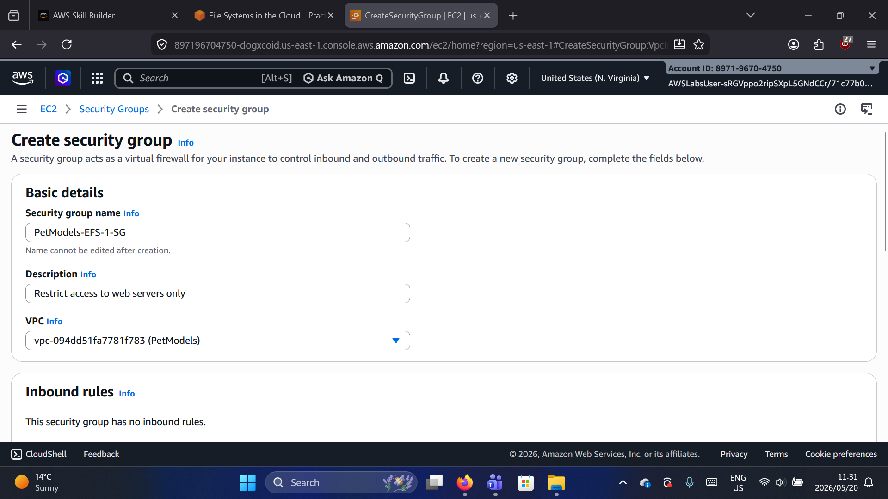
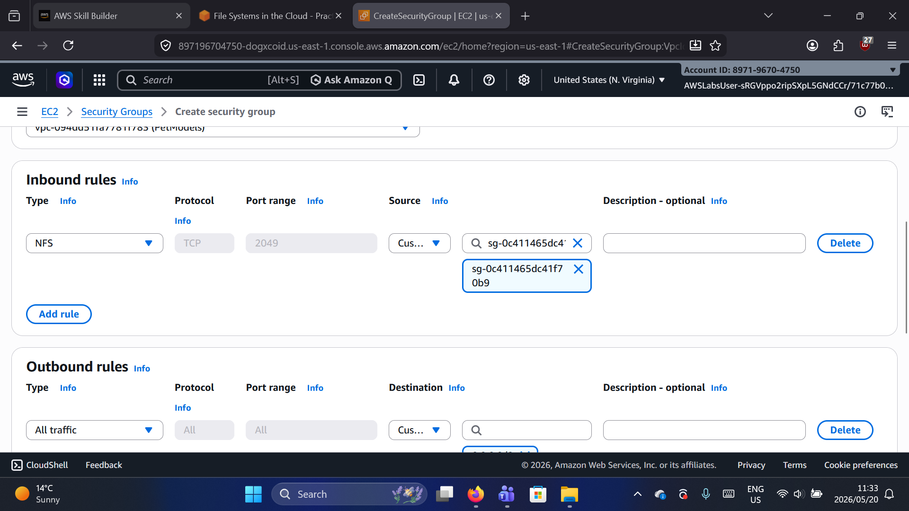
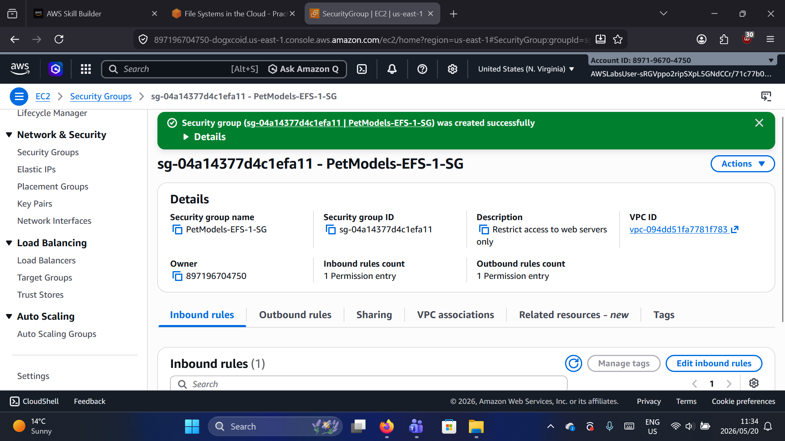
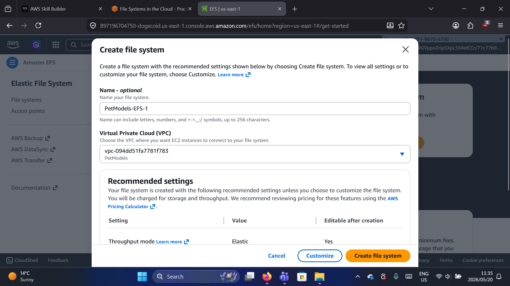
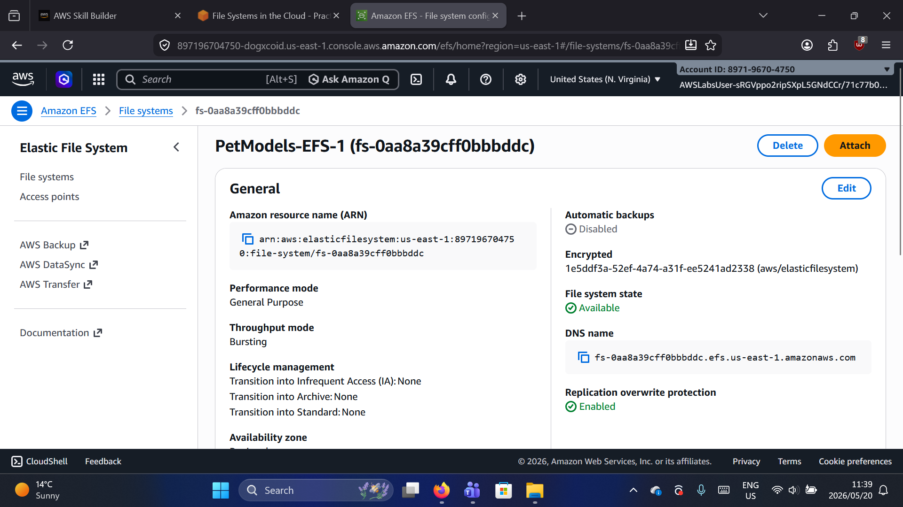
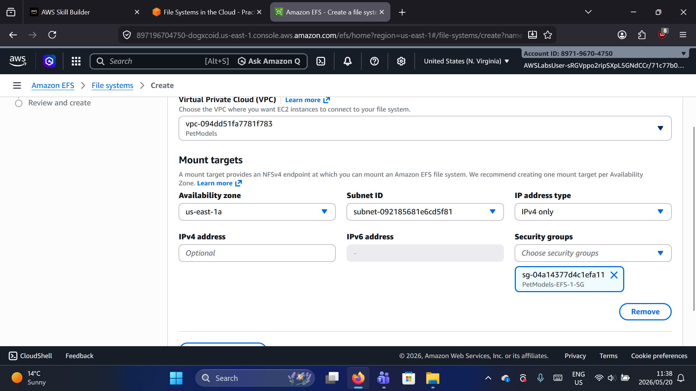
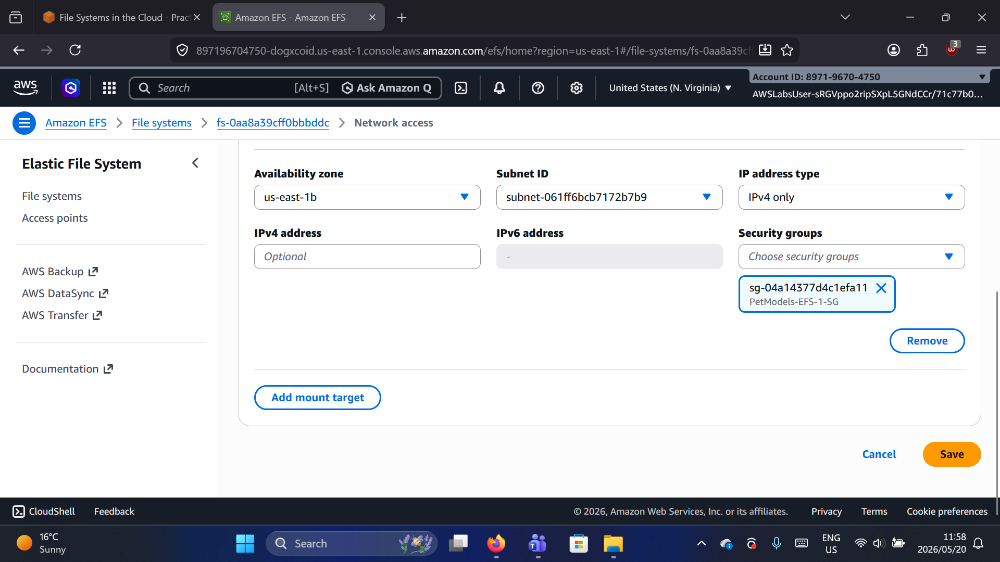
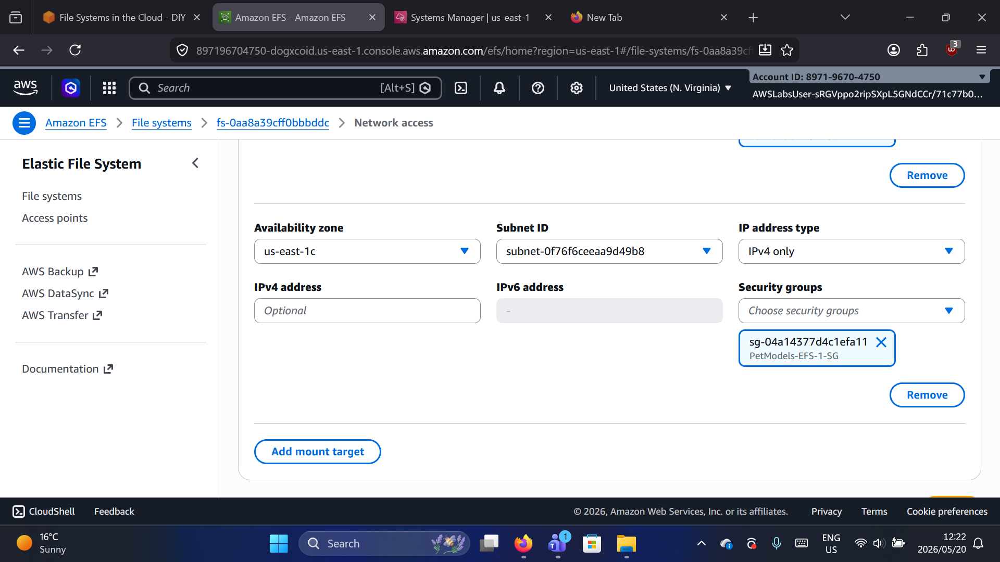
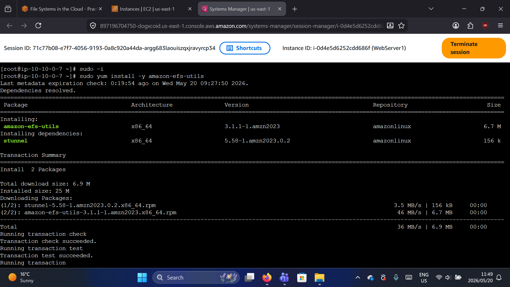
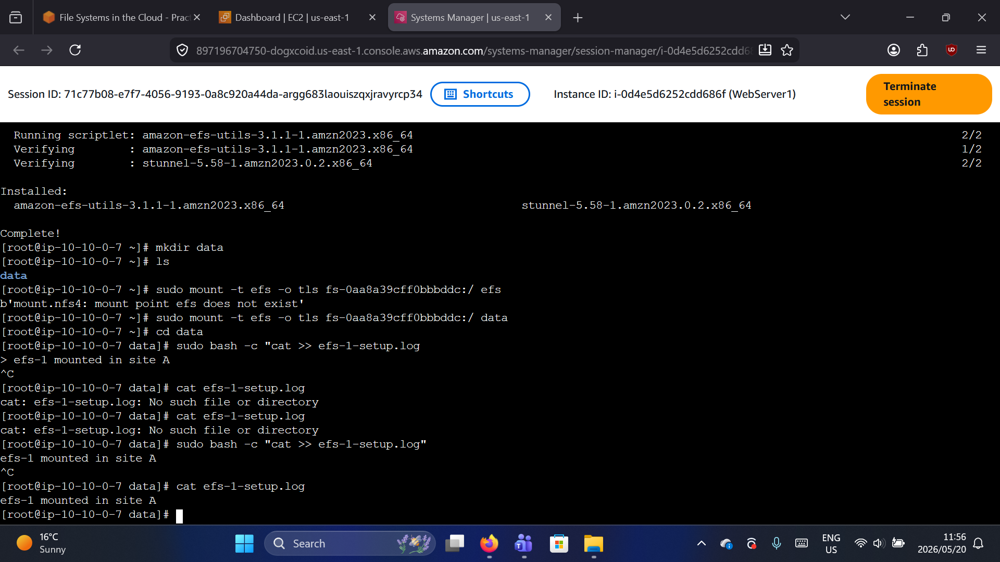

# Amazon EFS Lab – File Systems in the Cloud

## Lab Overview

In this lab, I created an Amazon Elastic File System (EFS) and mounted it to three EC2 instances across different Availability Zones. This demonstrated how EFS provides shared storage that multiple instances can access simultaneously.

**Date Completed:** May 20, 2026

**Author:** Owen Maake – AWS re/Start Participant | Aspiring SOC Analyst

---

## What is Amazon EFS?

Amazon EFS is a serverless, elastic file system that grows and shrinks automatically as you add and remove files. It can be mounted on multiple EC2 instances across different Availability Zones at the same time.

| Feature | Benefit |
|---------|---------|
| Serverless | No infrastructure to manage |
| Elastic | Grows and shrinks automatically |
| Shared | Multiple instances can access same files |
| Multi-AZ | Available across Availability Zones |

---

## Lab Architecture


*Figure 1: Lab architecture showing EFS mount targets across three Availability Zones*

The diagram above shows:
- **Availability Zone A** – Web server 1 with EFS mount target
- **Availability Zone B** – Web server 2 with EFS mount target  
- **Availability Zone C** – Web server 3 with EFS mount target

All three web servers share the same EFS file system.

---

## What I Did – Step by Step

### Step 1: Created a Security Group for EFS



*Figure 2: Creating the EFS security group*

I created a security group named `PetModels-EFS-1-SG` with:
- Description: "Restrict access to web servers only"
- VPC: PetModels VPC

---

### Step 2: Added Inbound Rule for NFS



*Figure 3: Adding inbound rule for NFS (port 2049)*

I added an inbound rule allowing NFS traffic on port 2049 from the web server security group.

---

### Step 3: Security Group Created Successfully



*Figure 4: Security group created and ready to use*

---

### Step 4: Created the EFS File System



*Figure 5: Creating the EFS file system*

I created an EFS file system with:
- Name: `PetModels-EFS-1`
- VPC: PetModels
- Throughput Mode: Elastic

---

### Step 5: EFS File System Created



*Figure 6: EFS file system details*

The file system was successfully created with ID `fs-0aa83cff0bbddc`.

---

### Step 6: Created Mount Target in us-east-1a



*Figure 7: Creating mount target in us-east-1a*

I created the first mount target in Availability Zone us-east-1a.

---

### Step 7: Created Mount Target in us-east-1b



*Figure 8: Creating mount target in us-east-1b*

I created the second mount target in Availability Zone us-east-1b.

---

### Step 8: Created Mount Target in us-east-1c



*Figure 9: Creating mount target in us-east-1c*

I created the third mount target in Availability Zone us-east-1c.

---

### Step 9: Installed EFS Utilities on EC2 Instances



*Figure 10: Installing amazon-efs-utils on EC2 instance*

On each EC2 instance, I ran:
```bash
sudo yum install -y amazon-efs-utils
---

## Step 10-12: Mount EFS, Create Test Files, and Verify Shared Storage



*Figure 10: Mounting EFS, creating test files, and verifying shared storage*

### Step 10: Created Mount Directory and Mounted EFS

On each EC2 instance, I ran:

```bash
# Create mount directory
mkdir data

# Mount EFS
sudo mount -t efs fs-0aa83cff0bbddc:/ data
