# AWS Security Group Lab – Configuring Database Connectivity

## Lab Overview

In this lab, I configured security group rules to allow a web server to communicate with a database server over port 3306 (MySQL). This exercise demonstrated how to control inbound traffic within a Virtual Private Cloud (VPC) to enable secure, multi-tier application connectivity.

**Date Completed:** June 2, 2026

**Author:** Owen Maake – AWS re/Start Participant | Aspiring SOC Analyst

## What is a Security Group?

A security group acts as a virtual firewall for your EC2 instances to control inbound and outbound traffic. By default, all inbound traffic is blocked. This lab focused on adding a specific rule to allow the web server to access the database server.

| Feature | Benefit |
| :--- | :--- |
| **Stateful** | Return traffic is automatically allowed, no matter the outbound rule. |
| **Allow Rules Only** | You cannot create "deny" rules (explicit deny is handled by Network ACLs). |
| **Scope** | Can be applied to multiple instances. |
| **Port Control** | Granular control using protocol and port range (e.g., TCP port 3306). |

## Lab Architecture

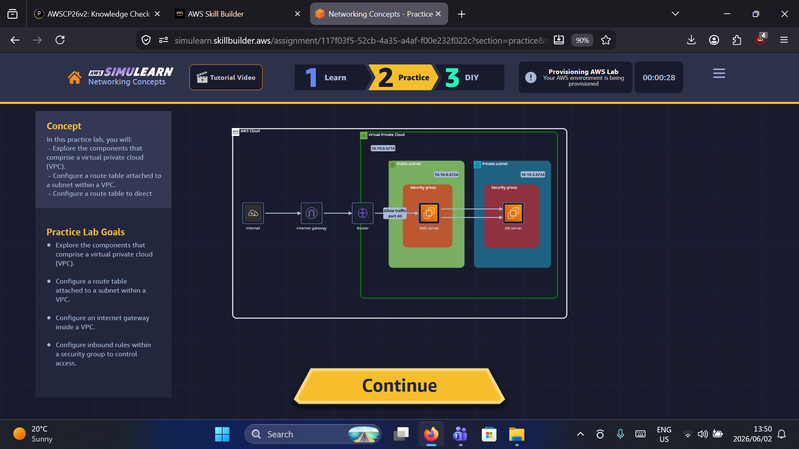

*Figure 1: Lab architecture showing a web server in a public subnet attempting to connect to a DB server in a private subnet.*

The diagram above shows:

- **Internet Gateway** – Allows public traffic to reach the web server.
- **Router & Route Tables** – Directs traffic between subnets and the internet.
- **Web Server** – Located in a public subnet (`10.10.0.0/24`).
- **DB Server** – Located in a private subnet (`10.10.2.0/24`), requiring a rule to accept traffic from the web server on port 3306.

## What I Did – Step by Step

### Step 1: Reviewed Initial Security Group Rules

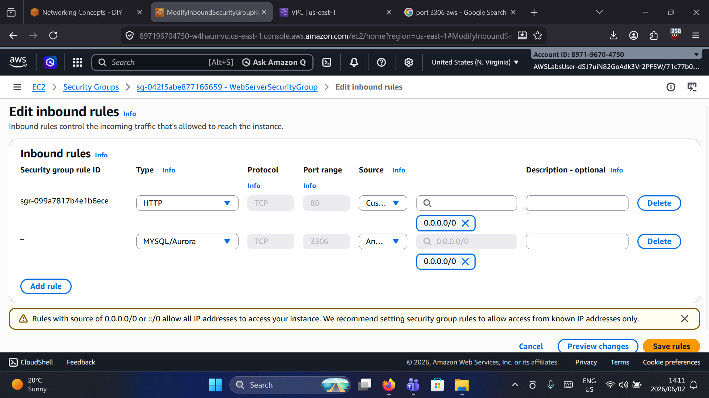

*Figure 2: Initial inbound rules (only HTTP port 80 is allowed, port 3306 is missing).*

Before any changes, the DB server only accepted HTTP traffic (`0.0.0.0/0` on port 80). No rule existed for MySQL traffic (port 3306).

### Step 2: Edited the Inbound Rules for the DB Server

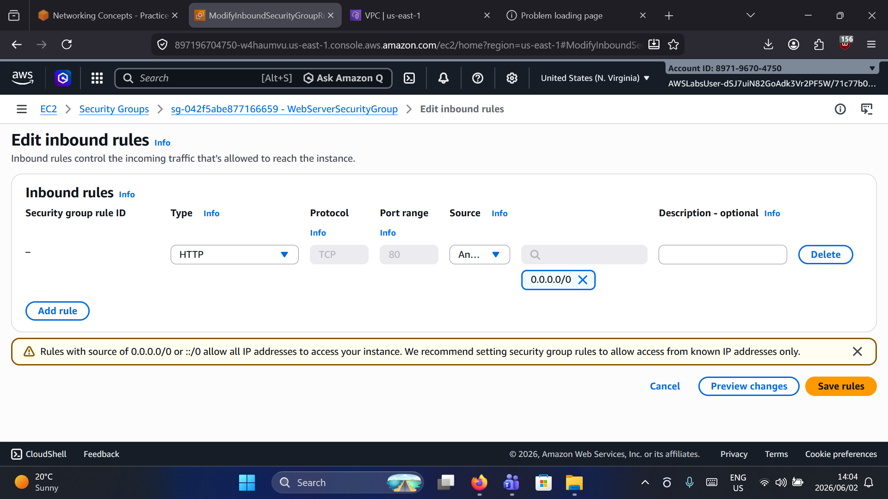

*Figure 3: Adding a new inbound rule for MySQL/Aurora.*

I selected **Edit inbound rules** for the DB server's security group and prepared to add a new rule.

### Step 3: Added MySQL Rule from Web Server Security Group

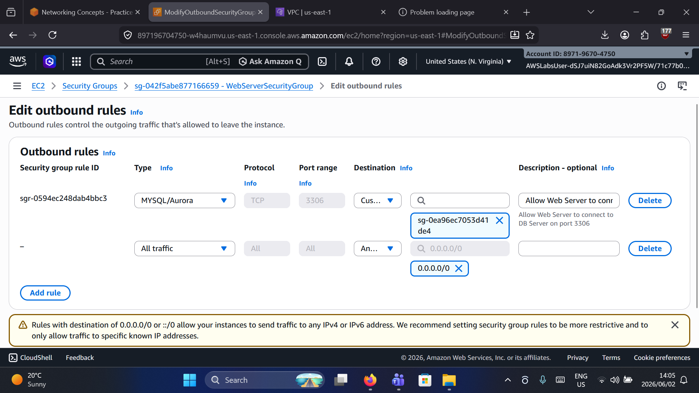

*Figure 4: Outbound rule (reference) showing the correct source configuration.*

To properly secure the environment, I did **not** use `0.0.0.0/0`. Instead, I configured the inbound rule to allow traffic **only** from the `WebServerSecurityGroup` (source: `sg-0ea96ec7053d41`) on port **3306**.

**Configuration:**
- **Type:** MySQL/Aurora
- **Protocol:** TCP
- **Port range:** 3306
- **Source:** `WebServerSecurityGroup` (Custom)

### Step 4: Verified EC2 Instances Were Running

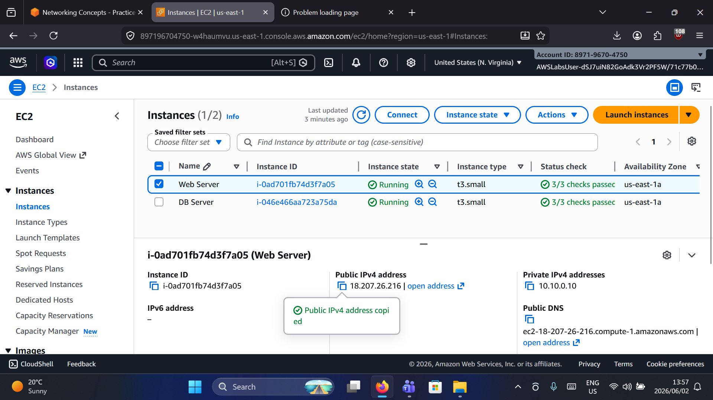

*Figure 5: Confirming both Web Server and DB Server are in a "Running" state.*

I checked the EC2 dashboard to ensure both servers were active before testing connectivity. The Web Server had a public IP (`18.207.26.216`).

### Step 5: Diagnosed Initial Connection Timeout

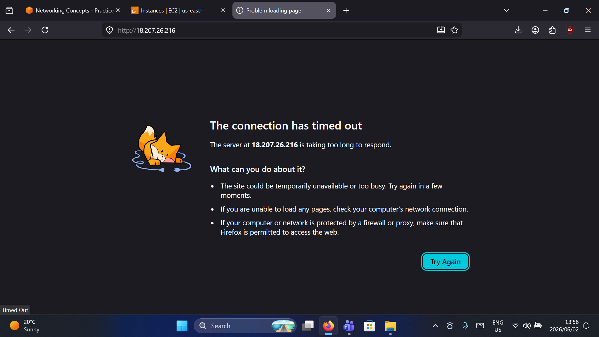

*Figure 6: Initial browser error when trying to reach the application (timeout).*

Before fixing the security group, the web application returned a "Connection Timed Out" error, confirming the web server could not reach the database on port 3306.

### Step 6: Verified Route Tables (Troubleshooting)

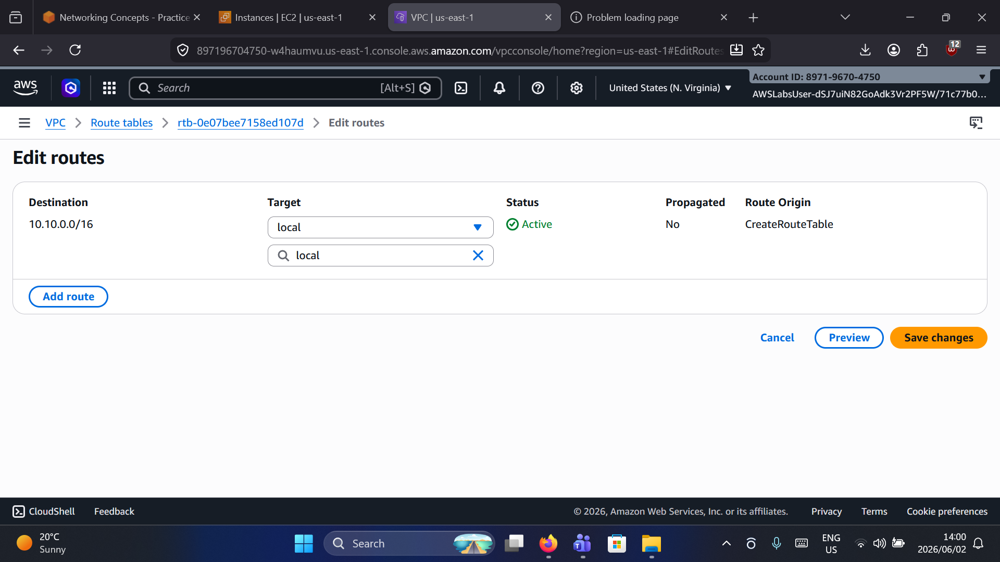

*Figure 7: Checking the main route table for the VPC.*

I verified the route tables to ensure network-level routing wasn't blocking the connection. The `local` route for `10.10.0.0/16` was active, ensuring traffic between subnets was allowed.

### Step 7: Added Internet Gateway Route

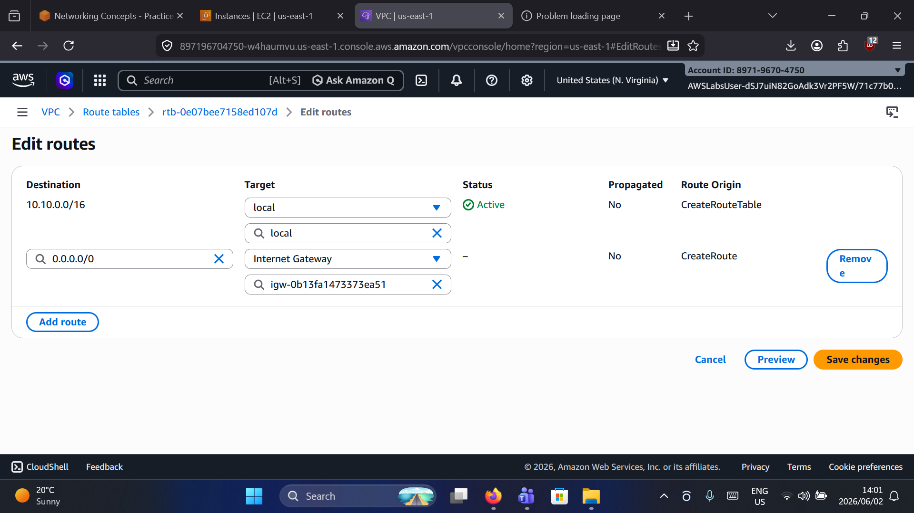

*Figure 8: Adding a route to the Internet Gateway for outbound internet access.*

I added a route for `0.0.0.0/0` targeting the Internet Gateway (`igw-0b13fa1473373ea51`) to allow outbound internet traffic from the public subnet.

### Step 8: Confirmed Subnet Association

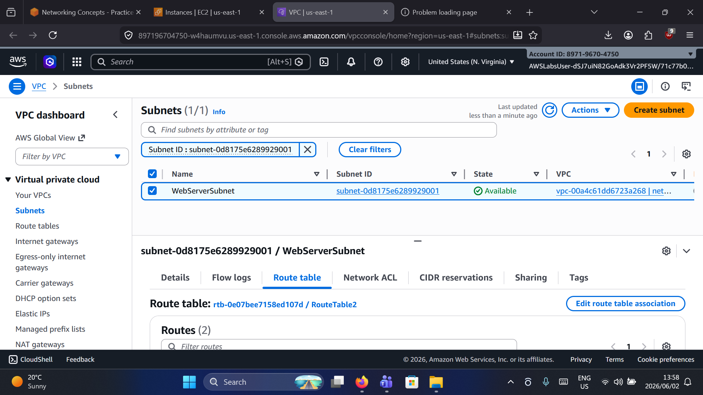

*Figure 9: Confirming WebServerSubnet is associated with the correct route table.*

I confirmed `WebServerSubnet` was correctly associated with `RouteTable2`, which had a route to the Internet Gateway for outbound internet access.

### Step 9: Reviewed DIY Goals

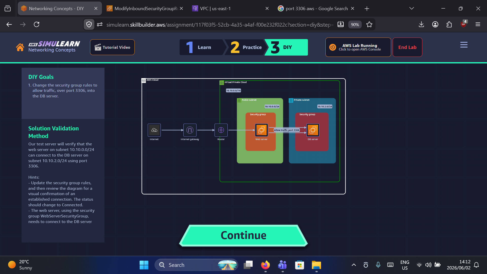

*Figure 10: Lab instructions showing the goal – allow port 3306 traffic into the DB server.*

The lab objective was clear: update security group rules to allow the web server (subnet `10.10.0.0/24`) to connect to the DB server (subnet `10.10.2.0/24`) on port 3306.

## Lab Validation

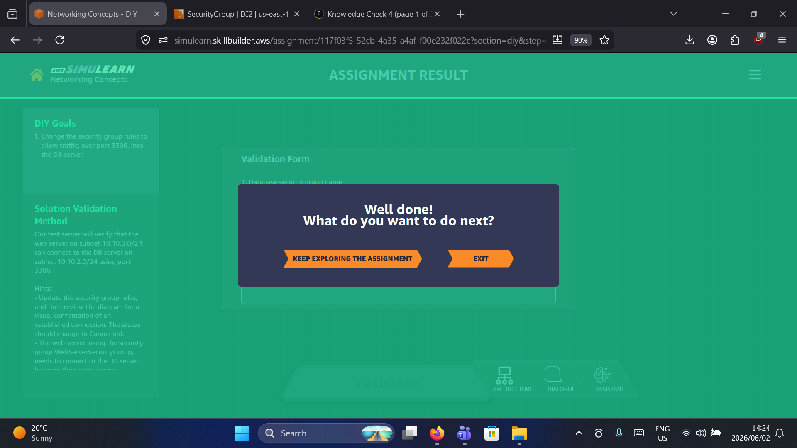

*Figure 11: Successful validation of the lab assignment.*

**Validation Method:**  
The test server successfully verified that the web server (subnet `10.10.0.0/24`) could connect to the DB server (subnet `10.10.2.0/24`) using port 3306.

**Result:** The status changed to **Connected**, confirming the security group rule was correctly configured.

## Key Takeaways

1.  **Least Privilege Access** – Instead of opening port 3306 to the entire internet (`0.0.0.0/0`), it is better to reference the specific security group (`WebServerSecurityGroup`).
2.  **Security Groups are Stateful** – Because the rule was added to the **DB Server's inbound**, the outbound response was automatically allowed.
3.  **Troubleshooting** – A connection timeout usually indicates a security group or Network ACL is blocking traffic, whereas a "connection refused" indicates the service isn't listening.
4.  **VPC Routing** – For two instances in the same VPC, a `local` route in the route table is sufficient for private communication.

## Next Steps

- Implement similar rules for other services (e.g., SSH on port 22 from a specific admin IP).
- Explore Network ACLs (stateless) for an additional layer of defense.
- Set up a bastion host to securely access private DB servers.# AWS Security Group Lab – Configuring Database Connectivity

## Lab Overview

In this lab, I configured security group rules to allow a web server to communicate with a database server over port 3306 (MySQL). This exercise demonstrated how to control inbound traffic within a Virtual Private Cloud (VPC) to enable secure, multi-tier application connectivity.

**Date Completed:** June 2, 2026

**Author:** Owen Maake – AWS re/Start Participant | Aspiring SOC Analyst

## What is a Security Group?

A security group acts as a virtual firewall for your EC2 instances to control inbound and outbound traffic. By default, all inbound traffic is blocked. This lab focused on adding a specific rule to allow the web server to access the database server.

| Feature | Benefit |
| :--- | :--- |
| **Stateful** | Return traffic is automatically allowed, no matter the outbound rule. |
| **Allow Rules Only** | You cannot create "deny" rules (explicit deny is handled by Network ACLs). |
| **Scope** | Can be applied to multiple instances. |
| **Port Control** | Granular control using protocol and port range (e.g., TCP port 3306). |

## Lab Architecture

*Figure 1: Lab architecture showing a web server in a public subnet attempting to connect to a DB server in a private subnet.*

The diagram above shows:

- **Internet Gateway** – Allows public traffic to reach the web server.
- **Router & Route Tables** – Directs traffic between subnets and the internet.
- **Web Server** – Located in a public subnet (`10.10.0.0/24`).
- **DB Server** – Located in a private subnet (`10.10.2.0/24`), requiring a rule to accept traffic from the web server on port 3306.

## What I Did – Step by Step

### Step 1: Reviewed Initial Security Group Rules

*Figure 2: Initial inbound rules (only HTTP port 80 is allowed, port 3306 is missing).*

Before any changes, the DB server only accepted HTTP traffic (`0.0.0.0/0` on port 80). No rule existed for MySQL traffic (port 3306).

### Step 2: Edited the Inbound Rules for the DB Server

*Figure 3: Adding a new inbound rule for MySQL/Aurora.*

I selected **Edit inbound rules** for the DB server’s security group and prepared to add a new rule.

### Step 3: Added MySQL Rule from Web Server Security Group

*Figure 4: Outbound rule (reference) showing the correct source configuration.*

To properly secure the environment, I did **not** use `0.0.0.0/0`. Instead, I configured the inbound rule to allow traffic **only** from the `WebServerSecurityGroup` (source: `sg-0ea96ec7053d41`) on port **3306**.

**Configuration:**
- **Type:** MySQL/Aurora
- **Protocol:** TCP
- **Port range:** 3306
- **Source:** `WebServerSecurityGroup` (Custom)

### Step 4: Verified EC2 Instances Were Running

*Figure 5: Confirming both Web Server and DB Server are in a "Running" state.*

I checked the EC2 dashboard to ensure both servers were active before testing connectivity. The Web Server had a public IP (`18.207.26.216`).

### Step 5: Diagnosed Initial Connection Timeout

*Figure 6: Initial browser error when trying to reach the application (timeout).*

Before fixing the security group, the web application returned a "Connection Timed Out" error, confirming the web server could not reach the database on port 3306.

### Step 6: Verified Route Tables (Troubleshooting)

*Figure 7: Checking the main route table for the VPC.*

I verified the route tables to ensure network-level routing wasn't blocking the connection. The `local` route for `10.10.0.0/16` was active, ensuring traffic between subnets was allowed.

### Step 7: Confirmed Subnet Association

*Figure 8: Confirming WebServerSubnet is associated with the correct route table.*

I confirmed `WebServerSubnet` was correctly associated with `RouteTable2`, which had a route to the Internet Gateway for outbound internet access.

## Lab Validation

*Figure 9: Successful validation of the lab assignment.*

**Validation Method:**  
The test server successfully verified that the web server (subnet `10.10.0.0/24`) could connect to the DB server (subnet `10.10.2.0/24`) using port 3306.

**Result:** The status changed to **Connected**, confirming the security group rule was correctly configured.

## Key Takeaways

1.  **Least Privilege Access** – Instead of opening port 3306 to the entire internet (`0.0.0.0/0`), it is better to reference the specific security group (`WebServerSecurityGroup`).
2.  **Security Groups are Stateful** – Because the rule was added to the **DB Server's inbound**, the outbound response was automatically allowed.
3.  **Troubleshooting** – A connection timeout usually indicates a security group or Network ACL is blocking traffic, whereas a "connection refused" indicates the service isn't listening.
4.  **VPC Routing** – For two instances in the same VPC, a `local` route in the route table is sufficient for private communication.

## Next Steps

- Implement similar rules for other services (e.g., SSH on port 22 from a specific admin IP).
- Explore Network ACLs (stateless) for an additional layer of defense.
- Set up a bastion host to securely access private DB servers.
