# AWS Lambda Lab – Serverless Sales Analysis Report Solution

## Lab Overview

In this lab, I deployed and configured an AWS Lambda-based serverless computing solution that generates a sales analysis report by pulling data from a database and emailing the results daily. The Lambda function is triggered by an Amazon CloudWatch Events rule at 8 PM every day (Monday through Saturday).

**Date Completed:** May 13, 2026

**Author:** Owen Maake – AWS re/Start Participant | Aspiring SOC Analyst

## What is AWS Lambda?

AWS Lambda is a serverless, event-driven compute service that lets you run code for virtually any type of application or backend service without provisioning or managing servers. You only pay for the compute time you consume.

| Feature | Benefit |
| :--- | :--- |
| **Serverless** | No infrastructure to manage |
| **Event-driven** | Responds to triggers from 200+ AWS services |
| **Automatic scaling** | Scales from zero to thousands of concurrent executions |
| **Pay-per-use** | Only charged for actual compute time |

## Lab Architecture

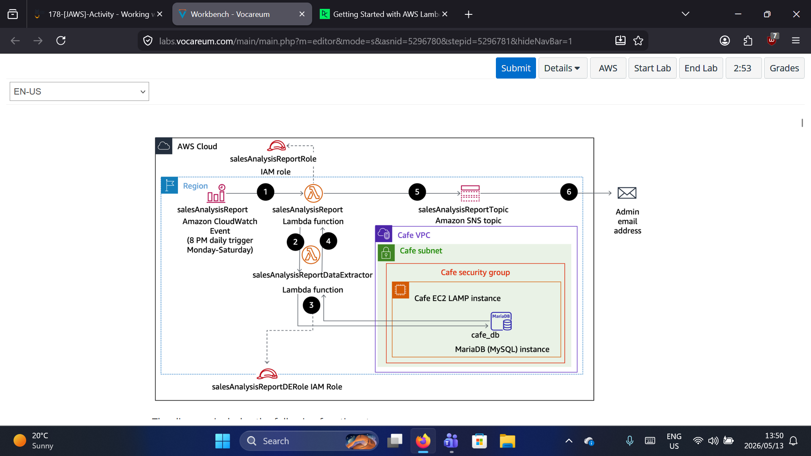

*Figure 1: Complete architecture of the sales analysis report solution.*

The diagram above shows the complete workflow:

| Step | Description |
| :--- | :--- |
| **1** | Amazon CloudWatch Events triggers `salesAnalysisReport` Lambda function at 8 PM daily (Monday–Saturday) |
| **2** | `salesAnalysisReport` invokes `salesAnalysisReportDataExtractor` Lambda function |
| **3** | `salesAnalysisReportDataExtractor` runs analytical query against `cafe_db` (MariaDB/MySQL) |
| **4** | Query results returned to `salesAnalysisReport` function |
| **5** | `salesAnalysisReport` formats report and publishes to `salesAnalysisReportTopic` SNS topic |
| **6** | SNS topic sends report by email to administrator |

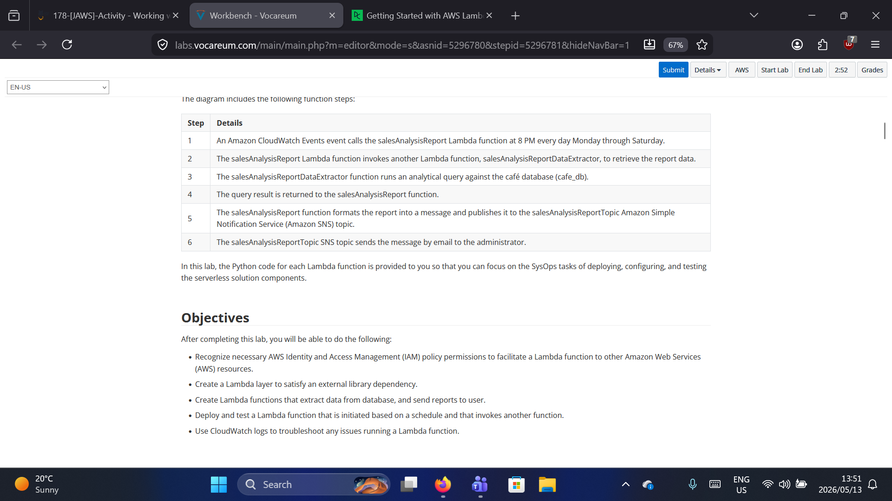

*Figure 2: Lab objectives and step-by-step workflow details.*

## What I Did – Step by Step

### Part 1: Created the Lambda Function

#### Step 1: Created the Lambda Function from Scratch

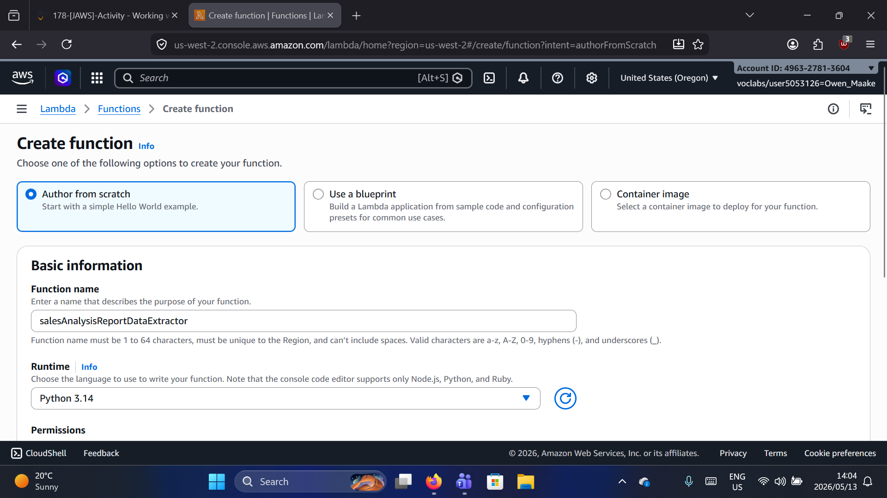

*Figure 3: Creating the Lambda function "salesAnalysisReportDataExtractor".*

I created a new Lambda function with the following configuration:
- **Function name:** `salesAnalysisReportDataExtractor`
- **Runtime:** Python 3.14
- **Architecture:** ARM64 (optimized for better price/performance)

#### Step 2: Configured the Execution Role

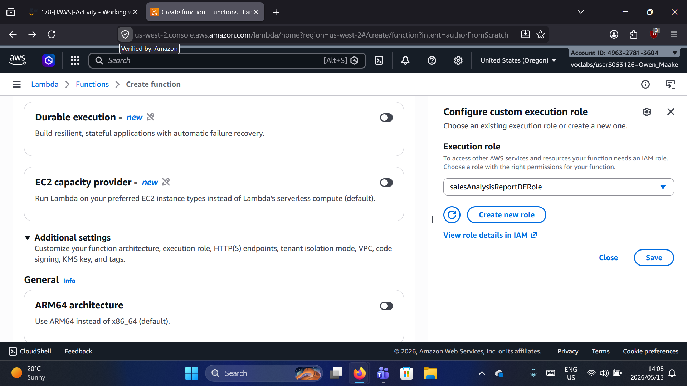

*Figure 4: Configuring the custom execution role.*

I selected the existing execution role `salesAnalysisReportDERole` which had the necessary permissions for the Lambda function to access other AWS services.

### Part 2: Created and Configured the Lambda Layer

#### Step 3: Created a Custom Lambda Layer

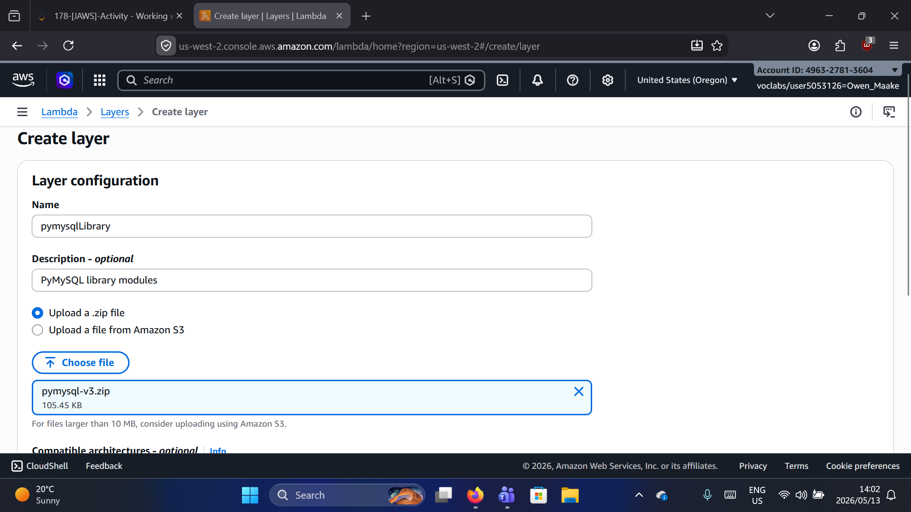

*Figure 5: Creating the pymysqlLibrary layer.*

Since the Lambda function needed to connect to a MySQL/MariaDB database, I created a custom layer containing the `pymysql` library:

- **Name:** `pymysqlLibrary`
- **Description:** PyMySQL library modules
- **Upload:** `pymysql-v3.zip` (105.45 KB)

#### Step 4: Added the Layer to the Function

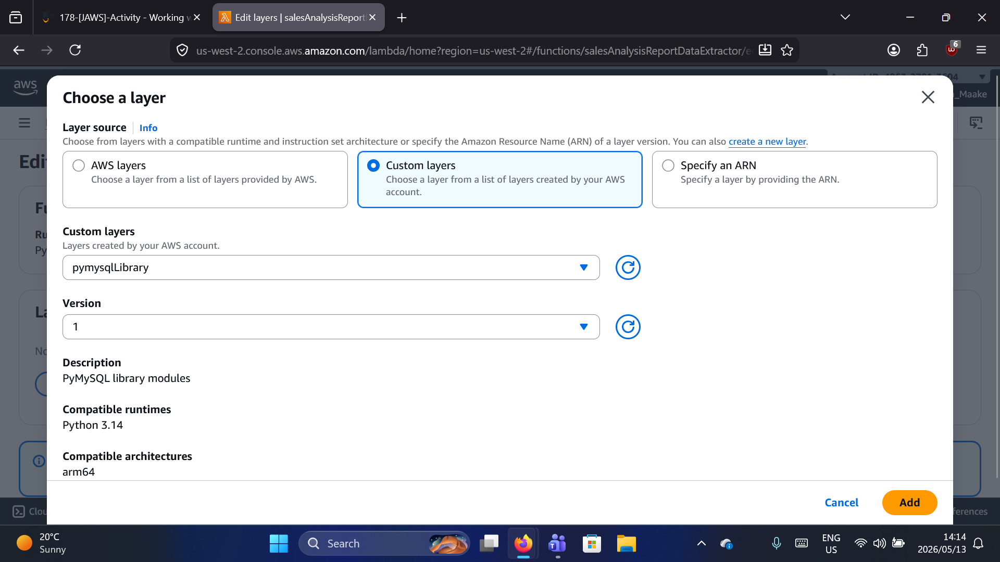

*Figure 6: Adding the pymysqlLibrary layer to the function.*

I added the custom layer with:
- **Layer:** `pymysqlLibrary`
- **Version:** 1
- **Compatible runtime:** Python 3.14
- **Compatible architecture:** arm64

### Part 3: Uploaded Function Code and Configured Runtime

#### Step 5: Uploaded the Function Code

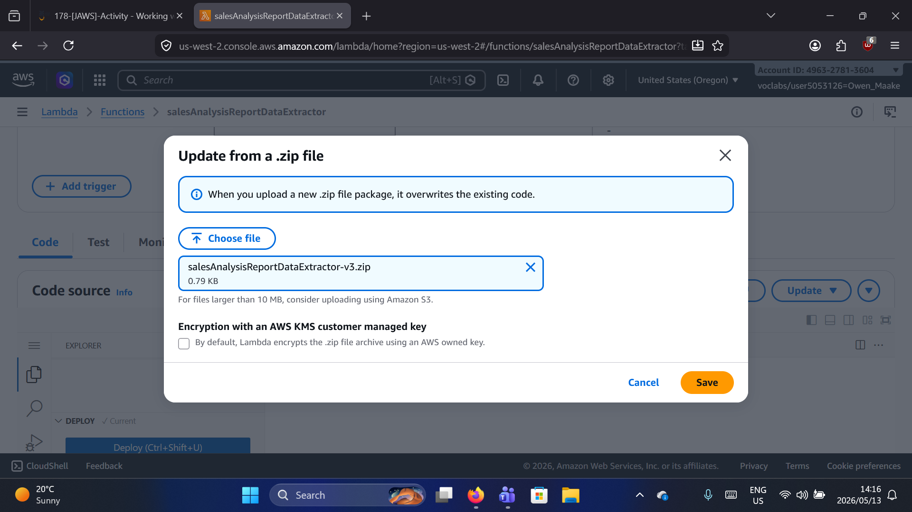

*Figure 7: Uploading the function code from a .zip file.*

I uploaded the `salesAnalysisReportDataExtractor-v3.zip` file containing the Python code for the Lambda function.

#### Step 6: Configured Runtime Settings

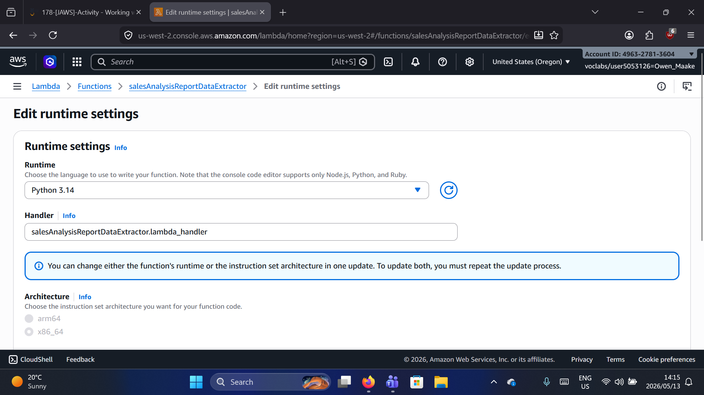

*Figure 8: Verifying runtime settings and handler configuration.*

The runtime settings were configured as:
- **Runtime:** Python 3.14
- **Handler:** `salesAnalysisReportDataExtractor.lambda_handler`
- **Architecture:** arm64

#### Step 7: Verified the Code Source

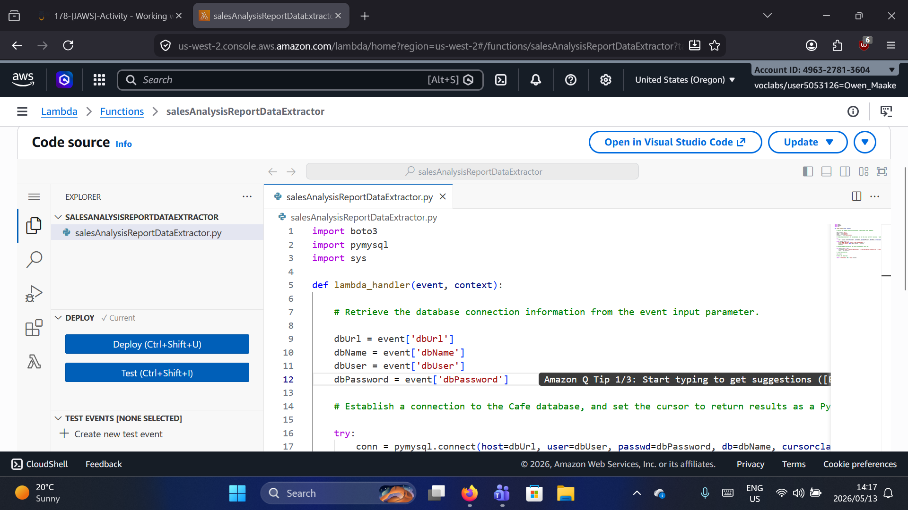

*Figure 9: The Lambda function code showing database connection logic.*

The Python code imports:
- `boto3` – AWS SDK for Python
- `pymysql` – MySQL database connector
- `sys` – System-specific parameters

The `lambda_handler` function:
1. Retrieves database connection info from the event parameter (`dbUrl`, `dbName`, `dbUser`, `dbPassword`)
2. Establishes a connection to the Cafe database
3. Sets up the cursor to return results

### Part 4: Configured VPC for Database Access

#### Step 8: Edited VPC Configuration

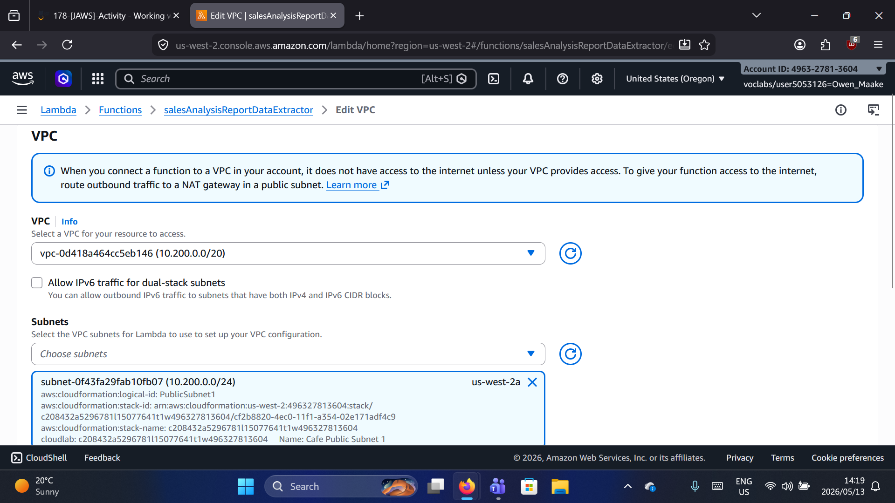

*Figure 10: Configuring VPC settings to allow database access.*

I configured the VPC settings so the Lambda function could access the Cafe database running on an EC2 instance:
- **VPC:** `vpc-0d418a464cc5eb146 (10.200.0.0/20)`
- **Subnet:** `subnet-0f43fa29fab10fb07 (10.200.0.0/24)` – Cafe Public Subnet 1

#### Step 9: Configured Security Group

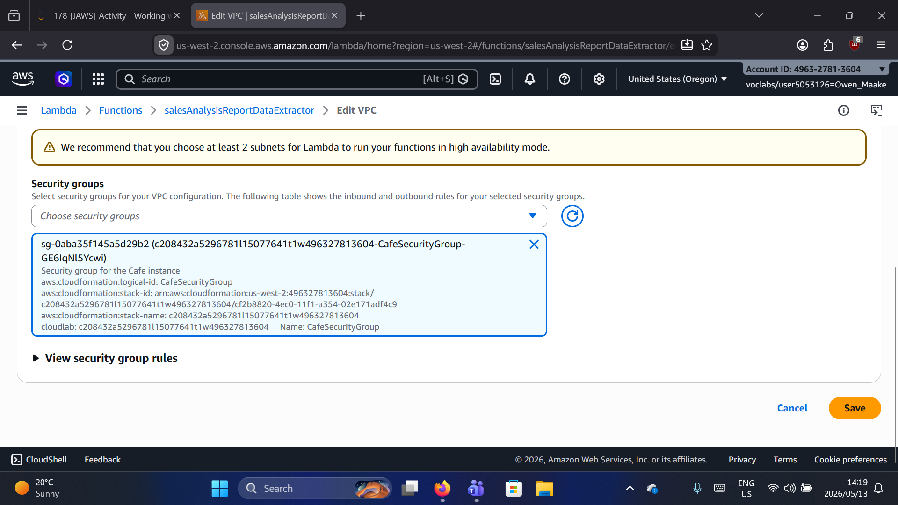

*Figure 11: Selecting the security group for VPC configuration.*

I selected the `CafeSecurityGroup` which allows the Lambda function to communicate with the Cafe EC2 instance running the MariaDB database.

### Part 5: Configured AWS CLI on EC2 (Database Setup)

#### Step 10: Configured AWS Credentials

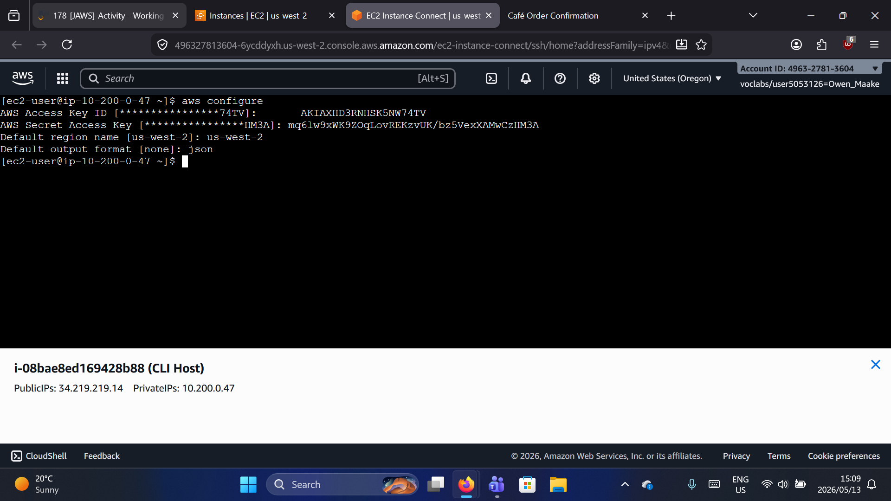

*Figure 12: Configuring AWS CLI on the EC2 instance.*

I configured the AWS CLI on the Cafe EC2 instance with the necessary access keys:
- **AWS Access Key ID:** Provided by the lab environment
- **AWS Secret Access Key:** Provided by the lab environment
- **Default region:** `us-west-2`
- **Default output format:** `json`

### Part 6: Created SNS Topic and Subscription

#### Step 11: Created SNS Topic

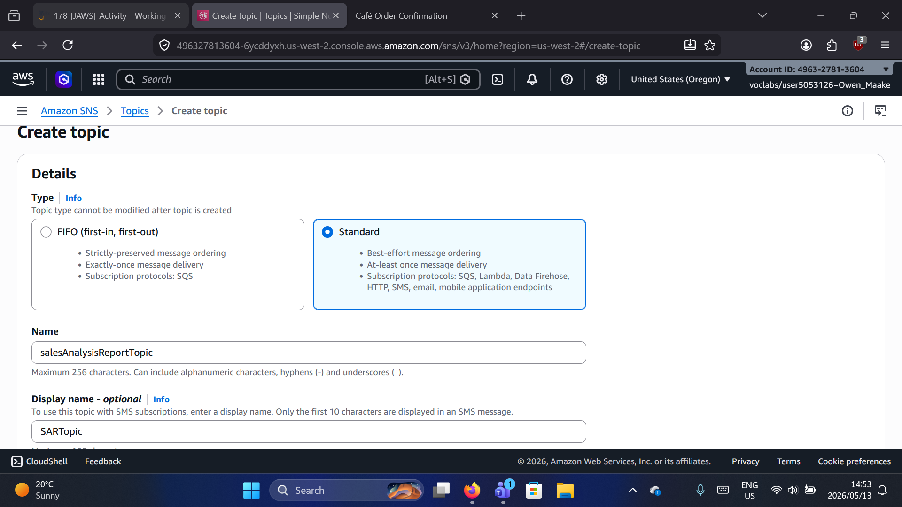

*Figure 13: Creating the SNS topic for email notifications.*

I created an SNS topic with:
- **Type:** Standard
- **Name:** `salesAnalysisReportTopic`
- **Display name:** `SARTopic`

#### Step 12: Created Email Subscription

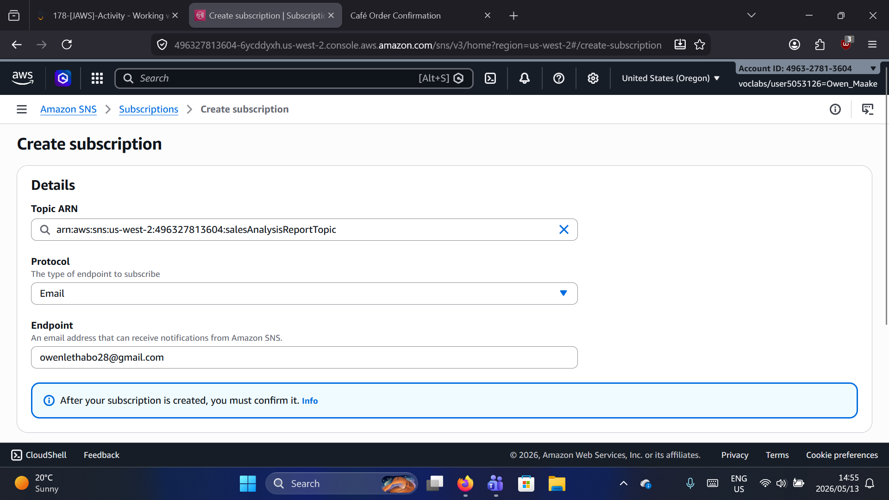

*Figure 14: Creating an email subscription to receive report notifications.*

I added an email subscription:
- **Protocol:** Email
- **Endpoint:** `owenlethabo28@gmail.com`

> **Note:** The subscription requires confirmation via email before receiving notifications.

### Part 7: Created and Executed Test Event

#### Step 13: Created Test Event

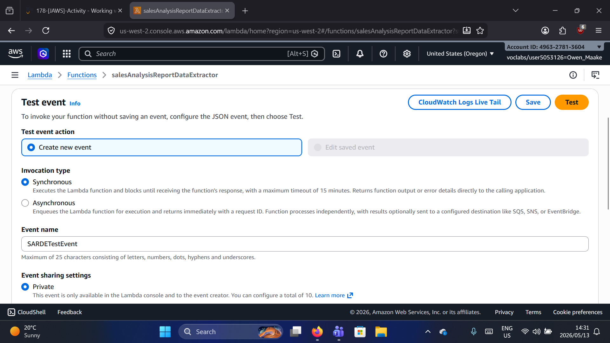

*Figure 15: Creating a test event to validate the Lambda function.*

I created a test event named `SARDETestEvent` with:
- **Invocation type:** Synchronous (waits for response)
- **Event sharing:** Private

The test event simulated the database connection parameters that would normally come from the parent Lambda function.

## Lab Validation

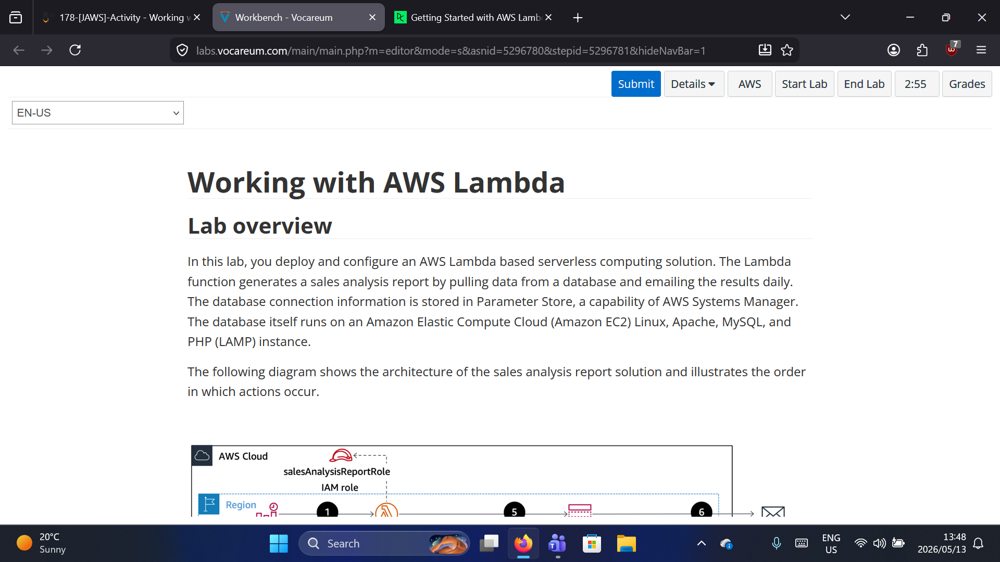

*Figure 16: Lab introduction – Working with AWS Lambda.*

The complete solution was successfully deployed and tested. The Lambda function is now ready to be triggered daily at 8 PM (Monday–Saturday) by CloudWatch Events, generating and emailing sales analysis reports automatically.

## Key Takeaways

1.  **Lambda Layers** – External libraries (like `pymysql`) should be packaged as Lambda layers for reusability and easier code management.

2.  **VPC Configuration** – Lambda functions must be connected to a VPC to access resources (like RDS or EC2 databases) inside private subnets.

3.  **Execution Roles** – Lambda functions require IAM roles with appropriate permissions to access other AWS services (CloudWatch, SNS, Systems Manager Parameter Store).

4.  **SNS Integration** – Lambda functions can publish messages to SNS topics, which then deliver notifications via email, SMS, or other protocols.

5.  **Event-Driven Architecture** – CloudWatch Events (now Amazon EventBridge) can trigger Lambda functions on a schedule, enabling automated reporting workflows.

## Troubleshooting Tips

| Issue | Common Cause | Solution |
| :--- | :--- | :--- |
| **Connection timeout** | Lambda not in correct VPC/subnet | Verify VPC and subnet configuration |
| **Module not found error** | Layer missing or incompatible | Check layer runtime compatibility and architecture |
| **Access denied errors** | IAM role missing permissions | Review and update execution role policies |
| **Database connection failed** | Security group blocking traffic | Ensure security group allows MySQL (port 3306) from Lambda |

## Next Steps

- Add error handling and dead-letter queues (DLQ) for failed invocations
- Implement AWS X-Ray tracing for performance monitoring
- Store database credentials in AWS Secrets Manager instead of passing via event
- Add CloudWatch alarms for function errors and throttles
- Extend the solution to support additional report formats (CSV, PDF)
